# CmRat by DTV Electronics

---

Please note: This repository is still under construction. Some files may be missing and will be uploaded soon.

---

The ‘CmRat’ carrier board allows a variety of Compute Modules (CM) to be installed and used alongside an NVMe hard drive. All the required expansion slots such as MicroSD, USB-C and a GPIO port to support a variety of Software/Linux and other FOSS solutions are also included.

Once configured the CmRat is capable of functioning as a fully-fledged micro server when paired with appropriate software. It operates consistently and robustly, ensuring reliable performance over time. Notably, it runs quietly, consumes minimal power, and boasts a compact physical form factor. These features make it an ideal choice for environments where space, energy efficiency, and reliable operation are paramount, such as home automation systems, small businesses, or edge computing setups.

Specifications:
- NVMe is designed for running the fastest/most reliable hard drives
- Ethernet and LCD Screen Support (via GPIO)
- POE, USB-C, or DC12v powered
- Large Heatsink design and quiet fan included
- Variety of 3d Printed Case designs on the market
- Designed for running Raspberry RPi CM4, CM5 or Radxa CM3/CM5

The project was originally developed by [Mirek](https://github.com/mfolejewski) under the project name ‘BitPiRat’ and has spurred a few different generations since then, with DTV Electronics finally releasing the project under the final retail version 2.8. 

Please take a look at the [included spec sheet](./spec-sheet.pdf) for more information.

## Table of Contents

- [CmRat by DTV Electronics](#cmrat-by-dtv-electronics)
  - [Table of Contents](#table-of-contents)
  - [About this repository](#about-this-repository)
  - [PCB Layout](#pcb-layout)
    - [Original Concept](#original-concept)
    - [BitPiRat Second Generation](#bitpirat-second-generation)
    - [CmRat project continues via DTV Electronics](#cmrat-project-continues-via-dtv-electronics)
    - [Final 2.8 Release Version from DTV Electronics](#final-28-release-version-from-dtv-electronics)
  - [Cases](#cases)
    - [Aluminium Retail Case](#aluminium-retail-case)
    - [3D Printed Third Party Cases](#3d-printed-third-party-cases)
  - [Add-ons](#add-ons)
    - [Examples](#examples)
  - [Supporters/Contributors](#supporterscontributors)

## About this repository

This repository contains the full manufacturing files for the CmRat, alongside spec sheets, pictures, and 3D models.

The repository is structured as follows:

- `readme-pictures/`: Contains images used in this README.
- `photos/`: Contains additional photos of the CmRat hardware.
- `manufacturing-files/`: Contains the manufacturing files for the CmRat.
  - `manufacturing-files/main-board/`: Contains Altium files for the main board of the CmRat.
  - `manufacturing-files/add-ons/`: Contains files for various add-ons.
    - `manufacturing-files/add-ons/lcd-module/`: Contains files for the LCD module add-on.
    - `manufacturing-files/add-ons/push-button/`: Contains files for the push button add-on.
- `3d-models/`: Contains 3D models of the CmRat.
- `spec-sheet.pdf`: A PDF document containing the specifications of the CmRat.
- `LICENSES/`: Contains the licenses for the manufacturing files and other content in this repository.
- `README.md`: This README file, providing an overview of the CmRat and its components.

All files in the manufacturing-files and 3d-models directory are licensed under the [CERN Open Hardware Licence Version 2 - Strongly Reciprocal](./LICENSES/CERN-OHL-S-2.0.txt).

All other files in this repository are licensed under the [Creative Commons Attribution-ShareAlike 4.0 International License](./LICENSES/CC-BY-SA-4.0.txt).

## PCB Layout

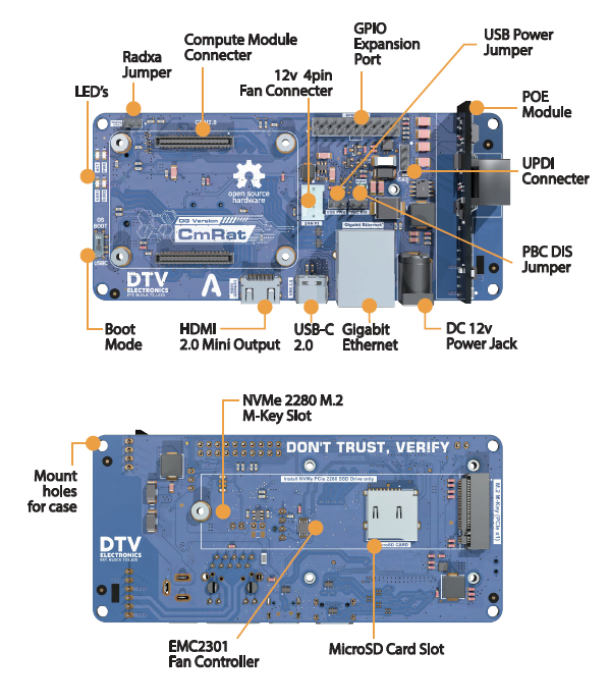

### Original Concept

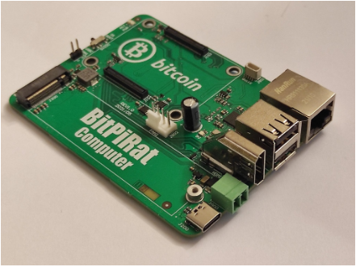

### BitPiRat Second Generation

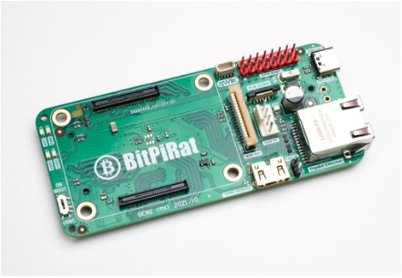

### CmRat project continues via DTV Electronics

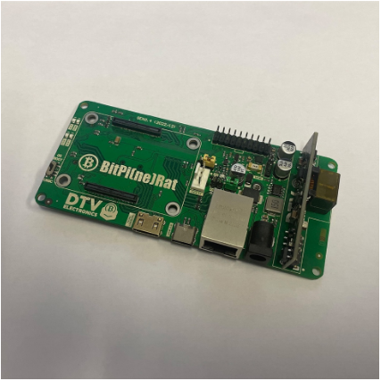

### Final 2.8 Release Version from DTV Electronics

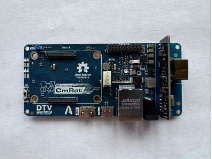

## Cases

### Aluminium Retail Case

The case has been designed from scratch by DTV Electronics using injection moulded production from secure and high quality ADC12 Aluminium materials. 

A fully CNC made and die casted mould allows enough airflow to keep the device running cool and quiet.

All connecter inputs are lined up perfectly within the unit allowing easy access when adding or removing cables. The PCB attaches to the bottom of the case with only 4 screws which secures everything in its entirety. The aluminium case is professionally oil painted and comes in a variety of colours. As it is essentially 2 parts (top and bottom), it allows a large amount of customisation and a variety of colours.

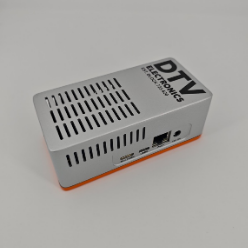 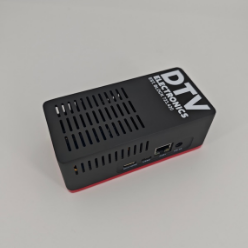

### 3D Printed Third Party Cases

There are a variety of 3d printed inspired cases online and the files are included in this repository. 

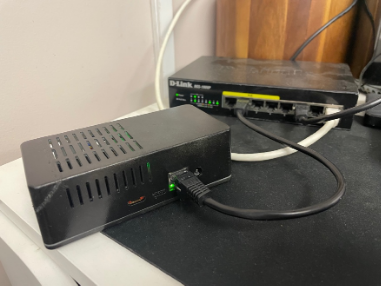
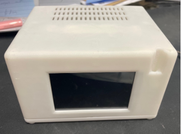
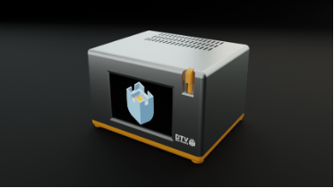
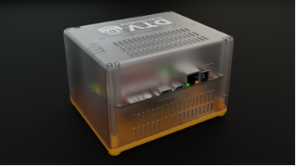
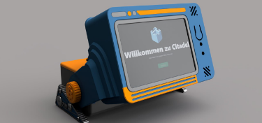

## Add-ons

A variety of add-ons that were originally developed by Mirek and DTV Electronics together which are included in the manufacturing files. These were not released in the retail version due to cost. The product was brought to market using only the slim case. However, there is an LCD module, Push Button Firmware, and a Push Button Controller.

This allows a screen to be attached via the GPIO port along with an on and off switch. This would have formed the concept for a larger case (shown above and listed as a 3d printed asset under ‘Max’)

All files necessary for the add-ons are included in the `manufacturing-files/addons/` directory. The firmware for the screen and push button controller is also included in the `manufacturing-files/addons/firmware/` directory. 

### Examples

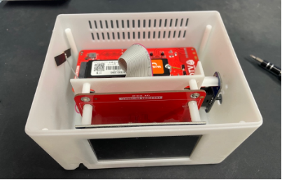
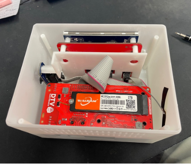

## Supporters/Contributors

- Adam of ‘Anlumen Technologies’
- Mirek of ‘PineBoards’
- Leo of ‘BuryRoadLabs’
- Aaron Dewes - Master Developer
- PrintergoBrr

